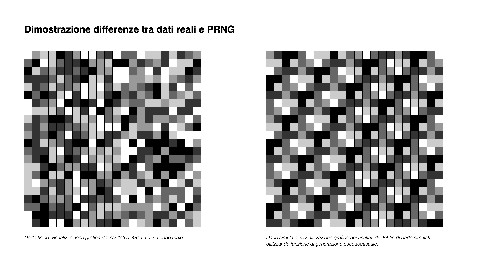

SUPSI 20223-24  
Corso d’interaction design, CV428.01  
Docenti: A. Gysin, G. Profeta  

Elaborato 1: XS 

# Titolo progetto
Autore: Roberta Valli
[Algoritmi pseuto random](https://ixd-supsi.github.io/2023/esempi/mp_hands/es6/1_landmarks)


## Introduzione e tema
La pagina web è dedicata a illustrare sia la storia evolutiva dell'algoritmo di generazione pseudocasuale di numeri sia il suo funzionamento tecnico. L'obiettivo principale è fornire una panoramica comprensibile dei concetti teorici e pratici dietro gli algoritmi di generazione di numeri pseudocasuali, con particolare attenzione agli sviluppi storici.


## Riferimenti progettuali
Per questo progetto, non ho seguito riferimenti progettuali specifici per la costruzione dell'interfaccia. Tuttavia, ho raccolto tutte le informazioni necessarie e i cenni storici da diverse fonti online, tra cui:

https://www.geeksforgeeks.org/pseudo-random-number-generator-prng/
https://en.wikipedia.org/wiki/Pseudorandom_number_generator
https://www.geeksforgeeks.org/generate-random-numbers-using-middle-square-method-in-java/
https://www.educative.io/answers/pseudo-random-number-using-the-middle-square-method


## Design dell’interfraccia e modalià di interazione
Il sito web "Pseudo Random" presenta un'interfaccia pensata per offrire una comprensione chiara e strutturata dei concetti legati alla generazione di numeri pseudocasuali. Diviso in sezioni tematiche ben definite (funzionamento generale degli algoritmi, middle square method e altri tipi di generatori) il design del sito utilizza testi informativi e illustrazioni visive per comunicare efficacemente i principi fondamentali dietro agli algoritmi pseudocasuali.

Ogni sezione è accessibile tramite un menu di ancoraggio, facilitando la navigazione diretta agli argomenti di interesse. Questo approccio permette agli utenti di esplorare in modo intuitivo i vari aspetti della generazione di numeri casuali, dalla teoria dei requisiti delle sequenze casuali all'implementazione pratica di algoritmi come il Middle Square Method e il Linear Congruential Generator.

L'uso di immagini esplicative e diagrammi contribuisce a rendere i concetti complessi più accessibili, supportando la comprensione visiva e facilitando l'apprendimento degli utenti interessati a questo campo. Il design dell'interfaccia si concentra sulla chiarezza e sull'organizzazione delle informazioni, garantendo una navigazione fluida e una fruizione efficace del contenuto educativo proposto.

[]()


## Tecnologia usata
La pagina è stata principalmente sviluppata utilizzando HTML e CSS. Per illustrare la differenza tra i numeri pseudocasuali generati da un algoritmo e i risultati di un dado reale, è stata realizzata una simulazione mediante l'algoritmo "Middle Square Method" implementato in JavaScript. Questo algoritmo genera una sequenza di numeri pseudocasuali compresi tra 1 e 6, replicando il comportamento di un dado fisico. Inizialmente, un seme viene elevato al quadrato e le cifre centrali determinano il prossimo numero nella sequenza. Questo processo si ripete aggiornando il seme ad ogni iterazione, garantendo che i numeri generati siano nel range desiderato attraverso normalizzazione e arrotondamento.

Dopo aver generato la sequenza di numeri, essi sono stati convertiti in tonalità di grigio per creare una rappresentazione visiva dei tiri del dado. Ogni numero pseudocasuale è stato associato a una scala di grigi, dove i numeri più alti corrispondono a tonalità più scure e quelli più bassi a tonalità più chiare. Di seguito è riportato il codice JavaScript utilizzato per questa simulazione:

```JavaScript
let seed = 5; // Inizializzazione del seme
let numTiri = 484; // Numero di tiri del dado da simulare
let results = []; // 

// Funzione per generare numeri pseudocasuali simili al dado
function R() {
    const x = (5 * seed + 1) % 16; // Calcolo del valore
    seed = x; // Aggiornamento del seme
    return x % 6 + 1; // restituisce un numero compreso tra 1 e 6
}

// Simulazione tiri del dado
for (let i = 0; i < numTiri; i++) {
    let risultato = R(); // Genera un numero pseudocasuale tra 1 e 6
    results.push(risultato); // Memorizza il risultato nell'array results
}

// Mappatura dei risultati su una scala di grigi e rappresentazione visiva
for (let i = 0; i < results.length; i++) {
    let num = results[i];
    let grayValue = map(num, 1, 6, 0, 255); // Mappatura del numero su una scala di grigi
    fill(grayValue); // Applica il colore grigio
    // Disegna un quadratino o un altro elemento visivo per rappresentare il risultato
}
```
[]()


## Target e contesto d’uso
Per questo progetto, il pubblico target erano i miei compagni di classe, persone con una certa competenza e familiarità nel campo, ma che non avevano mai affrontato l'algoritmo specifico spiegato. In generale, può essere utile a chiunque desideri scoprire il funzionamento di base degli algoritmi pseudocasuali e comprendere come vengano implementati per generare sequenze di numeri casuali.